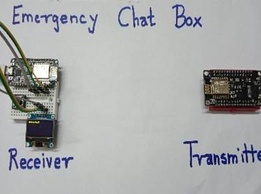
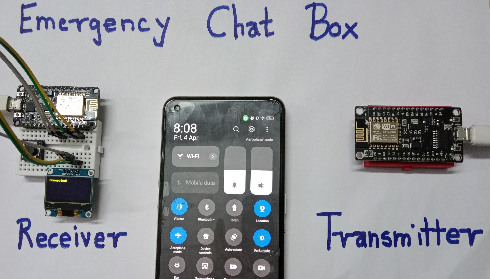
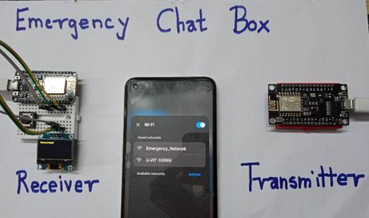
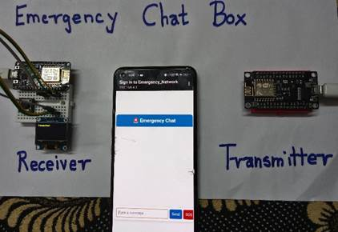
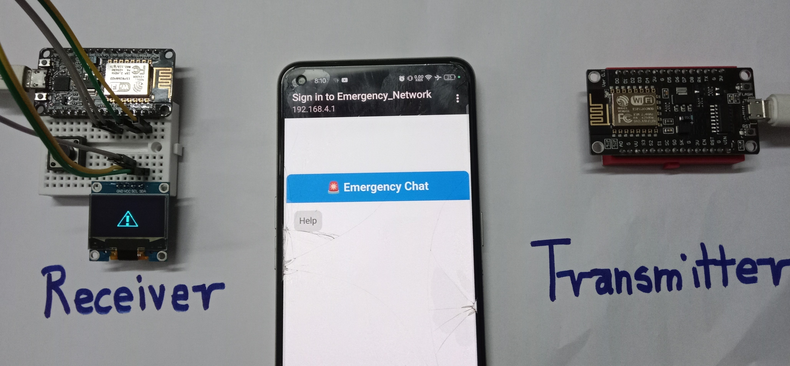
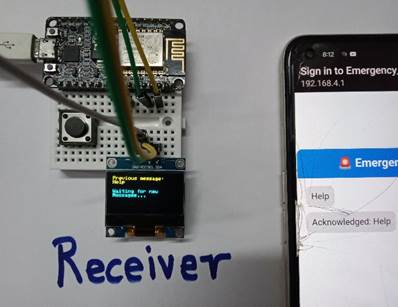

# Hardware Working Result – Emergency Chat Box

This section demonstrates the real-time working of the **Emergency Chat Box** built using ESP8266 modules. The system allows **offline emergency communication** without the need for internet or cellular networks.

---

##  Transmitter Setup

The **Sender ESP8266** creates a Wi-Fi Access Point named **"Emergency_Network"**, allowing devices to connect even in **Airplane Mode**.

Users are automatically redirected to a **captive portal** webpage to type emergency messages.

---

## Message Input via Captive Portal

When connected to the network, users are redirected to a chat interface.

Clicking **Send** transmits the message using **WebSockets** to the receiver device.

---

## Message Notification on Receiver

Once a message is received, the **Receiver ESP8266** blinks a **warning symbol** on the OLED display to alert the operator.

---

## Acknowledging the Message

When the **push button** on the receiver is pressed:
- A **tick (✔) symbol** is shown on OLED
- An **acknowledgment message** is sent back to the sender
- The OLED then shows the **last acknowledged message**

